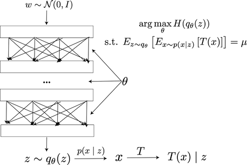
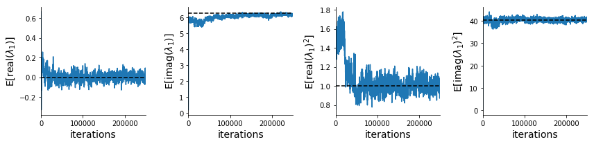
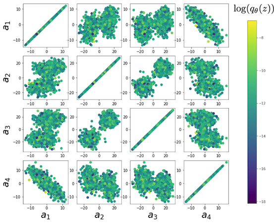

<script src='https://cdnjs.cloudflare.com/ajax/libs/mathjax/2.7.5/latest.js?config=TeX-MML-AM_CHTML' async></script>


<div class="topnav">
  <a class="active" href="#">Home</a>
  <a href="systems">DSN Systems Library</a>
</div>

Theoretical neuroscientists design and test mathematical models of neural activity, assessing a model's quality by its ability to replicate experimental results.  A general challenge has been addressing the indeterminacy of model parameterizations; different parameterizations of these models accurately reflect established experiments, yet make incompatible predictions about other aspects of neural activity.  Degenerate solution networks (DSNs) learn the full (i.e. maximum entropy) distribution of generative model parameterizations that yield a behavior of interest.  This is a tool designed for theorists, enabling a new class of model analyses relying on the full distribution of generative parameters that result in some statistically specified activity.

This tutorial explains how to use the dsn git repo to learn built-in or user-specified systems. 

# Installation #

You should follow the [standard install](#standard-install) instructions if you only intend to learn DSNs for the built-in systems.  If you intend to write tensorflow code for your own system class, you should use the [dev install](#dev-install).

## Standard install<a name="standard-install"></a> ##
These installation instructions are for users interested in learning degenerate solution spaces of systems, which are already implemented in the [DSN systems library](systems.md).  Clone the git repo, go to the base directory, and run the installer.
```bash
git clone https://github.com/cunningham-lab/dsn.git
cd dsn/
python setup.py install
```

## Dev install<a name="dev-install"></a> ##
If you intend to write some tensorflow code for your own system, then you want to use the development installation.  Clone the git repo, and then go to the base directory and run the development installer.
```bash
git clone https://github.com/cunningham-lab/dsn.git
cd dsn/
python setup.py develop
```

# Degenerate Solution Networks (DSNs) #
Oftentimes in theoretical neuroscience, we seek to design models or find parameterizations of models that produce emergent properties of behavior, rather than necessarily a group of data points collected in an experiment.  We have a host of methods from Bayesian machine learning that prescribe how to go from data points through a likelihood model and choice of prior to a posterior distributions on likely parameterizations to have produced such data.  But, how do we condition on emeregent properties of behavior that we prefer to define statistically.  We introduce degenerate solution networks (DSNs), which learn flexible approximations to maximum entropy distributions of model parameterizations, which produce emergent properties of interest.


Consider model parameterization $$z$$ and data $$x$$ generated from some generative model of interest with known sampling procedure and likelihood $$p(x \mid z)$$, which may or may not be known.  For example, neural circuit models usually have known sampling procedures for simulating activity given a circuit parameterization, yet often lack an explicit likelihood function for the neural activity due to the complex nonlinear dynamics. DSNs learn a distribution on parameters $$z$$, that yields a behavior of interest $$\mathcal{B}$$,
\begin{equation}
\mathcal{B}: E_{z \sim q_\theta}\left[ E_{x\sim p(x \mid z)}\left[T(x)\right] \right] = \mu
\end{equation}
by making a deep generative approximation $$q_\theta(z)$$ to $$p(z \mid \mathcal{B})$$.  So, over the degenerate solution distribution $$q_\theta(z)$$ of model $$p(x \mid z)$$ for behavior $$\mathcal{B}$$, the elements of vector T(x) (think sufficient statistics) are constrained in expectation to the corresponding elements of $$\mu$$.  The dimensionality of the image of $$T$$ and of $$\mu$$ is the total constraints enforced by $$\mathcal{B}$$.


 In deep generative models, a simple random variable $$w \sim p_0$$ is mapped deterministically via a function $$f_\theta$$ parameterized by a neural network to the support of the distribution of interest where $$z = f_{\theta}(w)$$.



Given a generative model $$p(x \mid z)$$ and some behavior of interest $$\mathcal{B}$$, DSNs are trained by optimizing
the deep generative parameters $$\theta$$ to find the optimal approximation $$q_{\theta}^*$$ within the deep generative
variational family $$Q$$ to $$p(z \mid \mathcal{B})$$. This procedure is loosely equivalent to variational inference
(VI) using a deep generative variational family with respect to the likelihood of the mean sufficient statistics rather
than the data itself ([Loaiza-Ganem et al. 2017](#Loaiza-Ganem2017maximum), [Bittner & Cunningham
2018](#Bittner2018approximating))  In most settings (especially those relevant to theoretical neuroscience) the likelihood of the behavior with respect to the model parameters $$p(T(x) \mid z)$$ is unknown or intractable, requiring an alternative to stochastic gradient variational bayes ([Kingma & Welling 2013](#Kingma2013autoencoding)) or black box variational inference ([Ranganath et al. 2014](#Ranganeth2014black)). Instead, DSNs are optimized with the following objective for a given generative model and statistical constraints on its produced activity:

\begin{equation}
q_\theta^*(z) = \mathop{\arg\,\max}\limits_{q_\theta \in Q} H(q_\theta(z))
\end{equation}
\begin{equation}
 \text{s.t.  } E_{z \sim q_\theta}\left[ E_{x\sim p(x \mid z)}\left[T(x)\right] \right] = \mu
\end{equation}

We use an augmented Lagrangian approach to run the constrained optimization.  This procedure is elaborated in the [linear system example](#auglag).

## Normalizing flow architecture ##
Since we are optimizing parameters  $$\theta$$ of our deep generative model with respect to the entropy, we will need to take gradients with respect to the log-density of samples from the DSN.

\begin{equation}
H(q_\theta(z)) = \int - q_\theta(z) \log(q_\theta(z)) dz = E_{z \sim q_\theta}\left[-\log(q_\theta(z)) \right] = E_{w \sim q_0}\left[-\log(q_\theta(f_\theta(w))) \right]
\end{equation}
\begin{equation}
\nabla_\theta H(q_\theta(z)) = E_{w \sim q_0}\left[- \nabla_\theta \log(q_\theta(f_\theta(w))) \right]
\end{equation}

Deep generative models typically consist of several layers of fully connected neural networks.  When each neural network layer is restricted to be a bijective function, the sample density can be calculated using the change of variables formula at each layer of the network. However, this computation has cubic complexity in dimensionality for fully connected layers.  By restricting our layers to normalizimg flows ([Rezende & Mohammed 2015](#Rezende2015variational)) -- bijective functions with fast log determinant jacobian computations, we can tractably optimize deep generative models with objectives that are a function of sample density, like entropy.  

This repository depends on [tf_util](https://github.com/cunningham-lab/tf_util), which has [code](https://github.com/cunningham-lab/tf_util/blob/master/tf_util/normalizing_flows.py) for several normalizing flow classes.  Most of our analyses use planar flows, which have proven to be most expressive and efficient in our architecture searches.

# <a name="Linear2D_example"></a> Example: Oscillating 2-D linear system. #

To provide intuition for DSNs to the reader, we discuss degenerate parameterizations of two-dimensional linear dynamical systems, 
\begin{equation}
\tau \dot{x} = Ax, A = \begin{bmatrix} a_1 & a_2 \\\\ a_3 & a_4 \end{bmatrix}
\end{equation}
 that produce a band of oscillations. To train a DSN to learn the maximally entropic distribution of real entries of the dynamics matrix $$z = \left[a_1, a_2, a_3, a_4 \right]^\top$$ that yield a band of oscillations, we choose $$T(x)$$ to contain the first- and second-moments of the oscillatory frequency $$\omega$$ and the primary growth/decay factor $$c$$ of the oscillating system. Let's say we want to learn the distribution of real entries of A that yield a $$c$$ around zero with variance 1.0, and oscillations at 1 Hz with variance 1.0.  We will then constrain the behavior of the DSN to have the following constraints:

 \begin{equation}
 \mu = E \begin{bmatrix} c \\\\ \omega \\\\ c^2 \\\\ \omega^2 \end{bmatrix} = \begin{bmatrix} 0.0 \\\\ 1.0 \\\\ 1.0 \\\\ 1.025 \end{bmatrix}
 \end{equation} 

 We could simuilate system activity $$x$$ from $$z$$ for some finite number of time steps, and estimate $$\omega$$ by e.g. taking the peak of the Discrete Fourier series.  Instead, we can compute that sufficient statistics for this oscillating behavior through a closed form function $$f_{p, T}(z)$$ by taking the eigendecomposition of the dynamics matrix.

 
\begin{equation}
E_{x\sim p(x \mid z)}\left[T(x)\right] = f_{p,T}(z) =  \begin{bmatrix} \text{real}(\lambda_1) \\\\ \frac{\text{imag}(\lambda_1)}{2 \pi} \\\\ \text{real}(\lambda_1)^2 \\\\ (\frac{\text{imag}(\lambda_1)}{2 \pi})^2 \end{bmatrix}
\end{equation}

Where $$\lambda_1$$ and $$\lambda_2$$ are eigenvalues of the dynamics matrix ordered by their real parts.

 Even though we can compute $$E_{z \sim q_\theta}\left[ E_{x\sim p(x \mid z)}\left[T(x)\right] \right]$$ in closed from via $$f_{p,T}$$, we cannot derive the distribution $$q^*_\theta$$, since the backward mapping from the mean parameters $$\mu$$ to the natural parameters $$\eta$$ of this exponential family is unknown.  Instead, we can train a DSN to learn the degenerate linear system parameterization.

First, import the following libraries.
```python
import os
import numpy as np
from dsn.train_dsn import train_dsn
from dsn.util.systems import Linear2D
from dsn.util.dsn_util import get_savedir
from dsn.util.plot_util import assess_constraints, plot_opt, dsn_pairplots
```

We choose our deep generative model by specifying 10 layers planar flows followed by a layer of elementwise multiplication and shift.
```python
# normalizing flow layer architecture
flow_type = 'PlanarFlow'
# number of layers
nlayers = 10
mult_and_shift = 'post';
arch_dict = {'D':4, \
             'latent_dynamics':None, \
             'mult_and_shift':mult_and_shift, \
             'TIF_flow_type':flow_type, \
             'repeats':nlayers};
```

This density network architecture is initialized using random seed 0.  It is then optimized to produce samples from an isotropic gaussian with variance 1.0.  This is done so that we start from a relatively entropic initialization.
```
# multivariate normal initialization variance
sigma_init = 1.0
random_seed= 0
```

If there are no pre-initialized weights for the architecture, variance, and random seed of choice in /results/inits/, then the DSN will be optimized to produce samples from the isotropic gaussian, save the weights in case this choice is made again, and proceed with learning the DSN.

To train a DSN to learn one of the [built in system classes](systems.md), you can use a system class from the `dsn.dsn_utils.systems` library.  Each system class constructor takes two dictionary arguments:

 `fixed params` -  the parameters of the model that won't be learned and their fixed values.  For example, if we want to learn the 4 real entries of A, but leave $$\tau$$ fixed at $$1.0$$, we do the following.
```python
# create an instance of the 2D linear system class, with free parameter A,
# tau = 1.0, and behavior of interest 'oscillation'.
fixed_params = {'tau':1.0};
``` 

 `behavior`: which specifies the type of behavior and associated constraints.  First, the behavioral type is set to 'oscillation'.  The first and second elements of the mean and variance vectors correspond to the real and imaginary components of the first eigenvalue, respectively.  If we want an average oscillatory frequency of 1.0 Hz and 0.0 growth/decay, and variances of 1.0, we do the following:
 ```python
# Specify desired mean and variance for the real and imaginary
# components of the first eigenvalue.
behavior_type = 'oscillation'
omega = 1.0; # 2 Hz
means = np.array([0.0, 2*np.pi*omega])
variances = np.array([1.0, 1.0])
behavior = {'type':behavior_type, 'means':means, 'variances':variances}
 ```

Then, we finally create an instance of the 2D linear system class.
```python
system = linear_2D(fixed_params, behavior)
```

Finally, we select some optimization hyperparameters, and off we go!
```python
# optimization hyperparams
batch_size = 1000;
c_init_order = 0
lr_order = -3

train_dsn(system, batch_size, arch_dict, \
          k_max=k_max, sigma_init=sigma_init, \
          c_init_order=c_init_order, lr_order=lr_order,\
          random_seed=random_seed, min_iters=5000, \
          max_iters=10000, check_rate=100, dir_str='test')

``` 

## <a name="auglag"> </a> Augmented lagrangian optimization ##
In general, to optimize $$q_\theta(z)$$, we run the constrained optimization using the augmented Lagrangian method.  We minimize the following objective:
\begin{equation}
L(\theta; \lambda, c) = -H(q_\theta) + \lambda^\top R(\theta) + \frac{c}{2}||R(\theta)||^2
\end{equation}
where $$\lambda \in \mathcal{R}^m$$ are the Lagrange multipliers and $$c$$ is the penalty coefficient.  For a fixed $$(\lambda, c)$$, we optimize $$\theta$$ with stochastic gradient descent.  We start with a low value of $$c$$ initially, and increase $$c$$ during each augmented Lagrangian epoch, as well as tune $$\lambda$$ based on the constraint violations.  For the linear 2-dimensional system, optimization hyperparameters were initialized to $$c_1 = 10^{0}$$ and $$\lambda_1 = \bf{0}$$.  The penalty coefficient is updated based on a hypothesis test regarding the reduction in constraint violation.  The p-value of $$E[||R(\theta_{k+1})||] > \gamma E[||R(\theta_{k})||]$$ is computed, and $$c_{k+1}$$ is updated  to $$\beta c_k$$ with probability $$1-p$$.  In general, we use $$\beta = 4.0$$ and $$\gamma = 0.25$$.  The other update rule is $$\lambda_{k+1} = \lambda_k + c_k \frac{1}{n} \sum_{i=1}^n (T(x^{(i)}) - \mu)$$.  

```python
basedir = os.getcwd()
savedir = basedir + '/' + get_savedir(system, arch_dict, \
                                   sigma_init, lr_order, \
                                   c_init_order, random_seed, 
                                   dir_str='test')
fname = savedir + 'opt_info.npz'
figs, AL_final_its, p_values = plot_opt([fname], [''])
```



Each augmented Lagrangian epoch runs for 50,000 iterations.  We consider the optimization to have converged when a null hypothesis test of constraint violations being zero is accepted for all constraints at a significance threshold 0.05.  This is the dotted line on the plots below depicting the optimization cutoff of the DSN optimization for the 2-dimensional linear system.  If the optimization is left to continue running, entropy may decrease, and structural pathologies in the distribution may be introduced.

Here, we plot the distribution learned by the DSN.  This is the distribution of $$z$$ at the point of the optimization where the constraint satisfaction null hypotheses are accepted (dotted line above).  
```python
dsn_pairplots([fname], 'Zs', system, system.D, f_str='identity', \
                c_str='log_q_z', legendstrs=[], AL_final_its=AL_final_its, \
                fontsize=14, ellipses=False, \
                pfname='temp1.png')
```


 Even this relatively simple system has nontrivial (though intuitively sensible) structure in the parameter distribution.  Indeed, more subtle model-behavior combinations will have even more complexity, further motivating DSNs.


Sean Bittner \\
January 6, 2019

# References #
Bittner, Sean R., and John P. Cunningham. *[Approximating exponential family models (not single distributions) with a
two-network architecture."](https://arxiv.org/abs/1903.07515){:target="_blank"}*. <a name="Bittner2018approximating"></a> arXiv preprint arXiv:1903.07515 (2019).

<a name="Kingma2013autoencoding"></a> Diederik P Kingma and Max Welling. *[Auto-encoding variational bayes](https://arxiv.org/abs/1312.6114){:target="_blank"}.* arXiv preprint arXiv:1312.6114, 2013. 

<a name="Loaiza-Ganem2017maximum"></a> Gabriel Loaiza-Ganem, Yuanjun Gao, and John P Cunningham. *[Maximum entropy flow networks](https://arxiv.org/abs/1701.03504){:target="_blank"}.* arXiv preprint arXiv:1701.03504, 2017.

<a name="Ranganeth2014black"></a> Rajesh Ranganath, Sean Gerrish, and David Blei. *[Black box variational inference](https://arxiv.org/abs/1401.0118){:target="_blank"}.* In Artificial Intelligence and Statistics, pages 814-822, 2014.

<a name="Rezende2015variational"></a> Danilo Jimenez Rezende and Shakir Mohamed. *[Variational inference with normalizing flows](https://arxiv.org/abs/1505.05770){:target="_blank"}.* arXiv preprint arXiv:1505.05770, 2015. <a name="Rezende2015variational"></a>

