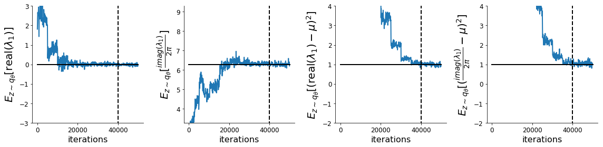

<script src='https://cdnjs.cloudflare.com/ajax/libs/mathjax/2.7.5/latest.js?config=TeX-MML-AM_CHTML' async></script>


<div class="topnav">
  <a class="active" href="#">Home</a>
  <a href="systems">DSN Systems Library</a>
</div>

Theoretical neuroscientists often design circuit models of neural activity with the hopes of producing some emergent property observed in data.  However, the standard inference toolkit is designed to condition on data points collected in an experiment, rather than the abstract notion of an emergent property.  We introduce a novel machine learning methodology called degenerate solution networks (DSNs), which learn a distribution of generative model parameterizations that produces the emergent property of interest, and is otherwise as random as possible.  As models continue to increase in complexity and become less tractable in terms of conventional analytic and theoretical approaches, DSNs will be a useful tool for theorists to interrogate their models.

Here, I'll provide a brief introduction to DSNs and their role in theoretical neuroscience, accompanied by a [tutorial](#Linear2D_example) for the code using a toy linear dynamical system.  [Installation instructions](#standard-install) are at the bottom of the page.


# Degenerate Solution Networks (DSNs) #
In theoretical neuroscience, we often want to design models or find parameterizations that produce emergent properties of behavior, rather than a group of data points collected in an experiment.  Common emergent properties of neuroscientific models are oscillation frequency, memory capacity, pardoxical effect, surround suppression, task execution, and many more.  However, statistical inference in computational neuroscience is never done directly on these mathematically abstracted quantities, due to the absence of such a methodology.  DSNs use recent advancements in machine learning to give us distributions of theoretical model parameters conditioned on the statistics of mathematically defined quantities of interest ([Bittner et al. 2019](#Bittner2019degenerate)).


We have a host of methods from Bayesian machine learning that prescribe how to go from data points through a likelihood model and choice of prior to a posterior distributions on likely parameterizations to have produced such data.  But, how do we condition on emergent properties of behavior that we prefer to define statistically?  DSNs combine ideas from likelihood-free variational inference ([Tran et al. 2018](#Tran2017hierarchical)) and maximum entropy flow networks ([Loaiza-Ganem et al. 2017](#Loaiza-Ganem2017maximum)).  A maximum entropy flow network is used as a deep generative model for the parameter distribution, while these samples are passed through a differentiable model/dynamics simulator, which can lack a tractable likelihood function.


Consider model parameterization $$z$$ and data $$x$$ generated from some theoretical model simulator represented as $$p(x \mid z)$$, which may be deterministic or stochastic.  Neural circuit models usually have known sampling procedures for simulating activity given a circuit parameterization, yet often lack an explicit likelihood function for the neural activity due to having nonlinear dynamics. DSNs learn a distribution on parameters $$z$$, that yields a behavior of interest $$\mathcal{B}$$,
\begin{equation}
\mathcal{B}: E_{z \sim q_\theta}\left[ E_{x\sim p(x \mid z)}\left[T(x)\right] \right] = \mu
\end{equation}
by making a deep generative approximation $$q_\theta(z)$$ to $$p(z \mid \mathcal{B})$$.  So, over the degenerate solution distribution $$q_\theta(z)$$ of model $$p(x \mid z)$$ for behavior $$\mathcal{B}$$, the elements of vector T(x) (think sufficient statistics) are constrained in expectation to the corresponding elements of $$\mu$$.  The dimensionality of the image of $$T$$ and of $$\mu$$ is the total constraints enforced by $$\mathcal{B}$$.

 In deep generative models, a simple random variable $$w \sim p_0$$ is mapped deterministically via a function $$f_\theta$$ parameterized by a neural network to the support of the distribution of interest where $$z = f_{\theta}(\omega) = f_l(..f_1(\omega))$$.


Given a theoretical model $$p(x \mid z)$$ and some behavior of interest $$\mathcal{B}$$, DSNs are trained by optimizing
the deep generative parameters $$\theta$$ to find the optimal approximation $$q_{\theta}^*$$ within the deep generative
variational family $$Q$$ to $$p(z \mid \mathcal{B})$$. This procedure is loosely equivalent to variational inference
(VI) using a deep generative variational family with respect to the likelihood of the mean sufficient statistics rather
than the data itself ([Loaiza-Ganem et al. 2017](#Loaiza-Ganem2017maximum), [Bittner & Cunningham
2019](#Bittner2019approximating)).  

In most settings (especially those relevant to theoretical neuroscience) the likelihood of the behavior with respect to the model parameters $$p(T(x) \mid z)$$ is unknown or intractable, requiring an alternative to stochastic gradient variational bayes ([Kingma & Welling 2013](#Kingma2013autoencoding)) or black box variational inference ([Ranganath et al. 2014](#Ranganeth2014black)).  These types of methods called likelihood-free variational inference (LFVI, [Tran et al. 2017](#Tran2017heirarchical)) skate around the intractable likelihood function in situations where there is a differentiable simulator. Akin to LFVI, DSNs are optimized with the following objective for a given generative model and statistical constraints on its produced activity:

\begin{equation}
q_\theta^*(z) = \mathop{\arg\,\max}\limits_{q_\theta \in Q} H(q_\theta(z))
\end{equation}
\begin{equation}
 \text{s.t.  } E_{z \sim q_\theta}\left[ E_{x\sim p(x \mid z)}\left[T(x)\right] \right] = \mu
\end{equation}

We use an augmented Lagrangian approach to run the constrained optimization.  This procedure is elaborated in the [linear system example](#auglag).

## Normalizing flow architecture ##
Since we are optimizing parameters  $$\theta$$ of our deep generative model with respect to the entropy, we will need to take gradients with respect to the log-density of samples from the DSN.

\begin{equation}
H(q_\theta(z)) = \int - q_\theta(z) \log(q_\theta(z)) dz = E_{z \sim q_\theta}\left[-\log(q_\theta(z)) \right] = E_{w \sim q_0}\left[-\log(q_\theta(f_\theta(w))) \right]
\end{equation}
\begin{equation}
\nabla_\theta H(q_\theta(z)) = E_{w \sim q_0}\left[- \nabla_\theta \log(q_\theta(f_\theta(w))) \right]
\end{equation}

Deep generative models typically consist of several layers of fully connected neural networks.  When each neural network layer is restricted to be a bijective function, the sample density can be calculated using the change of variables formula at each layer of the network. However, this computation has cubic complexity in dimensionality for fully connected layers.  By restricting our layers to normalizimg flows ([Rezende & Mohammed 2015](#Rezende2015variational)) -- bijective functions with fast log determinant jacobian computations, we can tractably optimize deep generative models with objectives that are a function of sample density, like entropy.  

This repository depends on [tf_util](https://github.com/cunningham-lab/tf_util), which has [code](https://github.com/cunningham-lab/tf_util/blob/master/tf_util/normalizing_flows.py) for several normalizing flow classes.  Most of our analyses use real NVP ([Dinh et al. 2017](#Dinh2016density), which have proven to be most expressive and efficient in our architecture searches.  If you'd like to learn more, here's a [normalizing flows tutorial](https://srbittner.github.io/2019/06/26/normalizing_flows/).

# <a name="Linear2D_example"></a> Example: Oscillating 2-D linear system. #

To provide intuition for DSNs to the reader, we discuss degenerate parameterizations of two-dimensional linear dynamical systems, 
\begin{equation}
\tau \dot{x} = Ax, A = \begin{bmatrix} a_1 & a_2 \\\\ a_3 & a_4 \end{bmatrix}
\end{equation}
 that produce a band of oscillations. To train a DSN to learn the maximally entropic distribution of real entries of the dynamics matrix $$z = \left[a_1, a_2, a_3, a_4 \right]^\top$$ that yield a band of oscillations, we choose $$T(x)$$ to contain the first- and second-moments of the oscillatory frequency $$\omega$$ and the primary growth/decay factor $$c$$ of the oscillating system. Let's say we want to learn the distribution of real entries of A that yield a $$c$$ around zero with variance 1.0, and oscillations at 1 Hz with variance 1.0.  We will then constrain the behavior of the DSN to have the following constraints:

 \begin{equation}
 \mu = E \begin{bmatrix} c \\\\ \omega \\\\ c^2 \\\\ \omega^2 \end{bmatrix} = \begin{bmatrix} 0.0 \\\\ 1.0 \\\\ 1.0 \\\\ 1.025 \end{bmatrix}
 \end{equation} 

 We could simuilate system activity $$x$$ from $$z$$ for some finite number of time steps, and estimate $$\omega$$ by e.g. taking the peak of the Discrete Fourier series.  Instead, we can compute that sufficient statistics for this oscillating behavior through a closed form function $$g(z)$$ by taking the eigendecomposition of the dynamics matrix.

 
\begin{equation}
E_{x\sim p(x \mid z)}\left[T(x)\right] = g(z) =  \begin{bmatrix} \text{real}(\lambda_1) \\\\ \frac{\text{imag}(\lambda_1)}{2 \pi} \\\\ \text{real}(\lambda_1)^2 \\\\ (\frac{\text{imag}(\lambda_1)}{2 \pi})^2 \end{bmatrix}
\end{equation}

\begin{equation} 
\lambda = \frac{(\frac{a_1 + a_4}{\tau}) \pm \sqrt{(\frac{a_1+a_4}{\tau})^2 + 4(\frac{a_2 a_3 - a_1 a_4}{\tau})}}{2}
\end{equation}

Where $$\lambda_1$$ and $$\lambda_2$$ are eigenvalues of the dynamics matrix ordered by their real parts.

 Even though we can compute $$E_{z \sim q_\theta}\left[ E_{x\sim p(x \mid z)}\left[T(x)\right] \right]$$ in closed form via $$g(z)$$, we cannot derive the distribution $$q^*_\theta$$, since the backward mapping from the mean parameters $$\mu$$ to the natural parameters $$\eta$$ of this exponential family is unknown.  Instead, we can train a DSN to learn the degenerate linear system parameterization.

First, import the following libraries.
```python
%matplotlib inline
import matplotlib.pyplot as plt
import numpy as np
import tensorflow as tf
from dsn.train_dsn import train_dsn
from dsn.util.dsn_util import get_system_from_template, get_arch_from_template, get_savedir, load_DSNs
from dsn.util.plot_util import plot_opt, dsn_pairplots
from tf_util.tf_util import dgm_hessian
```

To train a DSN to learn one of the [built in system classes](systems.md), you can use a system class from the `dsn.dsn_utils.systems` library.  We construct the Linear2D system from the class template selecting the mean target frequency $$\omega = 1$$.
```python
sysname = "Linear2D"
omega = 1.0
param_dict = {'omega':omega}
system = get_system_from_template(sysname, param_dict)
```

We choose our deep generative model by specifying one repeat of the template Real NVP mask sequence for this system, two layers per mask, and a DSN initialization of an isotropic gaussian with standard deviation of 3.0.  This template also includes a final affine layer, and a closed support of $$\left[-20,20\right]$$ for each parameter (see architecture templates documentation.)
```
arch_params = {
               'D':system.D,
               'repeats':1,
               'nlayers':2,
               'sigma_init':3.0,
              }
param_dict.update(arch_params)
arch_dict = get_arch_from_template(sysname, param_dict)

```

If there are no pre-initialized weights for the architecture, variance, and random seed of choice in /data/inits/, then the DSN will be optimized to produce samples from that isotropic gaussian.  The code will save the weights in /data/inits/, in case this choice is made again, and proceed with training the DSN.

The following code will train the DSN with the selected optimization hyperparameters.  Aug. lag. parameter $$c_0 = 10^{\text{c_init_ord=-4}}$$, Aug. lag. factor $$\beta$$=4.0, batch size is $$n=1000$$, iterations per Aug. lag. epoch iters=5000, diagnostics recording check_rate=100, Adam optimizer learning rate $$lr=10^{\text{lr_order=-3}}$$.
```python
c_init_ord = -4
random_seed = 1
dir_str = "LDS"

cost, z = train_dsn(
    system,
    arch_dict,
    n=1000,
    AL_it_max=10,
    c_init_order=c_init_ord,
    AL_fac=4.0,
    min_iters=5000,
    max_iters=5000,
    random_seed=random_seed,
    lr_order=-3,
    check_rate=100,
    dir_str=dir_str,
    db=False,
)
```


## <a name="auglag"> </a> Augmented lagrangian optimization ##
In general, to optimize $$q_\theta(z)$$, we run the constrained optimization using the augmented Lagrangian method.  We minimize the following objective:
\begin{equation}
L(\theta; \lambda, c) = -H(q_\theta) + \lambda^\top R(\theta) + \frac{c}{2}||R(\theta)||^2
\end{equation}
where $$\lambda \in \mathcal{R}^m$$ are the Lagrange multipliers and $$c$$ is the penalty coefficient.  For a fixed $$(\lambda, c)$$, we optimize $$\theta$$ with stochastic gradient descent.  We start with a low value of $$c$$ initially, and increase $$c$$ during each augmented Lagrangian epoch, as well as tune $$\lambda$$ based on the constraint violations.  For the linear 2-dimensional system, optimization hyperparameters were initialized to $$c_0 = 10^{-4}$$ and $$\lambda_1 = \bf{0}$$.  The penalty coefficient is updated based on a hypothesis test regarding the reduction in constraint violation.  The p-value of $$E[||R(\theta_{k+1})||] > \gamma E[||R(\theta_{k})||]$$ is computed, and $$c_{k+1}$$ is updated  to $$\beta c_k$$ with probability $$1-p$$.  In general, we use $$\beta = 4.0$$ and $$\gamma = 0.25$$.  The other update rule is $$\lambda_{k+1} = \lambda_k + c_k \frac{1}{n} \sum_{i=1}^n (T(x^{(i)}) - \mu)$$.  

```python
savedir = get_savedir(system, arch_dict, c_init_ord, random_seed, dir_str)
model_dirs = [savedir]
figs, ME_its = plot_opt(model_dirs, frac_samps=0.5);
```



Each augmented Lagrangian epoch runs for 5,000 iterations.  We consider the optimization to have converged when a null hypothesis test of constraint violations being zero is accepted for all constraints at a significance threshold 0.05.  This is the dotted line on the plots below depicting the optimization cutoff of the DSN optimization for the 2-dimensional linear system.  If the optimization is left to continue running, entropy may decrease, and structural pathologies in the distribution may be introduced.

## DSN posterior ##
Here, we plot the distribution learned by the DSN.  This is the distribution of $$z$$ at a point of the optimization where the constraint satisfaction null hypotheses are accepted that is maximum entropy (dotted line above).  
```python
Zs, log_q_zs, axs = dsn_pairplots(model_dirs, 'Zs', system, ME_its)
```


 Even this relatively simple system has nontrivial (though intuitively sensible) structure in the parameter distribution. More subtle model-behavior combinations will have even more complexity, further motivating DSNs.

We can visually verify that this posterior produces a distribution of behavior that our convergence criteria have asserted.

```python
T_xs, _, axs = dsn_pairplots(model_dirs, 'T_xs', system, ME_its)
```


The real part of the primary eigenvalue is centered at zero with variance 1, and the imaginary part is centered at $$2\pi$$ with variance 1, as we had conditioned on.

## Behavioral robustness via the Hessian ##
This probabilistic approach to system analysis allows us to analyze the Hessian, $$\frac{\partial^2 \log q_\theta(z)}{\partial z \partial z^\top}$$, for different $$z$$s and conditioned on various emergent properties $$\mathcal{B}$$.  You can calculate the hessian using the `dgm_hessian` function.

```python
sessions, tf_vars, feed_dicts = load_DSNs(model_dirs, ME_its)
sess = sessions[0]
W, Z, Z_INV, log_q_Z, batch_norm_mus, batch_norm_sigmas, batch_norm_means, batch_norm_vars = tf_vars[0]
feed_dict = feed_dicts[0]

T_xs = system.compute_suff_stats(Z)
H = dgm_hessian(log_q_Z, W, Z, Z_INV)
```

Below, the solid line shows the Hessian eigenmode of greatest degeneracy, and the dotted line shows the dimension of least degeneracy.


This code uses [Fast hessians for deep generative models](https://srbittner.github.io/2019/08/13/dgm_hessians/).

# Installation #

You should follow the [standard install](#standard-install) instructions if you only intend to learn DSNs for the built-in systems.  If you intend to write tensorflow code for your own system class, you should use the [dev install](#dev-install).

## Standard install<a name="standard-install"></a> ##
These installation instructions are for users interested in learning degenerate solution spaces of systems, which are already implemented in the [DSN systems library](systems.md).  Clone the git repo, go to the base directory, and run the installer.
```bash
git clone https://github.com/cunningham-lab/dsn.git
cd dsn/
python setup.py install
```

## Dev install<a name="dev-install"></a> ##
If you intend to write some tensorflow code for your own system, then you want to use the development installation.  Clone the git repo, and then go to the base directory and run the development installer.
```bash
git clone https://github.com/cunningham-lab/dsn.git
cd dsn/
python setup.py develop
```
Sean Bittner \\
August 24, 2019

# References #
Sean R. Bittner, and John P. Cunningham. *[Approximating exponential family models (not single distributions) with a
two-network architecture.](https://arxiv.org/abs/1903.07515){:target="_blank"}*. <a name="Bittner2019approximating"></a> arXiv preprint arXiv:1903.07515, 2019.

<a name="Bittner2019degenerate"></a> Sean R. Bittner, Agostina Palmigiano, Kenneth D. Miller, and John P. Cunningham. *[Degenerate solution networks for theoretical neurosciece](https://github.com/cunningham-lab/dsn/blob/master/written/Cosyne/poster/CosynePoster.pdf){:target="_blank"}*. <a name="degenerate"></a> CoSyNe, 2019.

<a name="Dinh2016density"></a>Dinh, Laurent, Jascha Sohl-Dickstein, and Samy Bengio. "*[Density estimation using real nvp](https://arxiv.org/abs/1605.08803){:target="_blank"}*." arXiv preprint arXiv:1605.08803 (2016).

<a name="Kingma2013autoencoding"></a> Diederik P Kingma and Max Welling. *[Auto-encoding variational bayes](https://arxiv.org/abs/1312.6114){:target="_blank"}.* arXiv preprint arXiv:1312.6114, 2013. 

<a name="Loaiza-Ganem2017maximum"></a> Gabriel Loaiza-Ganem, Yuanjun Gao, and John P Cunningham. *[Maximum entropy flow networks](https://arxiv.org/abs/1701.03504){:target="_blank"}.* arXiv preprint arXiv:1701.03504, 2017.

<a name="Ranganeth2014black"></a> Rajesh Ranganath, Sean Gerrish, and David Blei. *[Black box variational inference](https://arxiv.org/abs/1401.0118){:target="_blank"}.* In Artificial Intelligence and Statistics, pages 814-822, 2014.

<a name="Rezende2015variational"></a> Danilo Jimenez Rezende and Shakir Mohamed. *[Variational inference with normalizing flows](https://arxiv.org/abs/1505.05770){:target="_blank"}.* arXiv preprint arXiv:1505.05770, 2015. <a name="Rezende2015variational"></a>

<a name="Tran2017hierarchical"></a> Dustin Tran, Rajesh Ranganeth, and David Blei *[Hierarchical Implicit Models and Likelihood-Free Variational Inference](http://papers.nips.cc/paper/7136-hierarchical-implicit-models-and-likelihood-free-variational-inference){:target="_blank"}.* NIPS, 2017.


