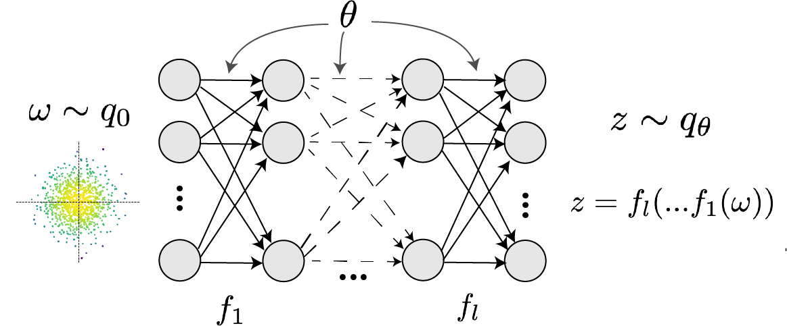
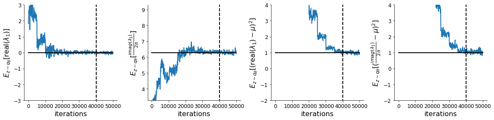

<script src='https://cdnjs.cloudflare.com/ajax/libs/mathjax/2.7.5/latest.js?config=TeX-MML-AM_CHTML' async></script>


<div class="topnav">
  <a class="active" href="#">Home</a>
  <a href="systems">DSN Systems Library</a>
</div>

Theoretical neuroscientists design and test mathematical models of neural activity, assessing a model's quality by its ability to replicate experimental results.  A general challenge has been addressing the indeterminacy of model parameterizations; different parameterizations of these models accurately reflect established experiments, yet make incompatible predictions about other aspects of neural activity.  Degenerate solution networks (DSNs) learn the full (i.e. maximum entropy) distribution of generative model parameterizations that yield a behavior of interest.  This is a tool designed for theorists, enabling a new class of model analyses relying on the full distribution of generative parameters that result in some statistically specified activity.

This tutorial explains how to use the dsn git repo to learn built-in or user-specified systems. 

# Installation #

You should follow the [standard install](#standard-install) instructions if you only intend to learn DSNs for the built-in systems.  If you intend to write tensorflow code for your own system class, you should use the [dev install](#dev-install).

## Standard install<a name="standard-install"></a> ##
These installation instructions are for users interested in learning degenerate solution spaces of systems, which are already implemented in the [DSN systems library](systems.md).  Clone the git repo, go to the base directory, and run the installer.
```bash
git clone https://github.com/cunningham-lab/dsn.git
cd dsn/
python setup.py install
```

## Dev install<a name="dev-install"></a> ##
If you intend to [write some tensorflow code for your own system](#)(<- TODO add link for this), then you want to use the development installation.  Clone the git repo, and then go to the base directory and run the development installer.
```bash
git clone https://github.com/cunningham-lab/dsn.git
cd dsn/
python setup.py develop
```

# Degenerate Solution Networks (DSNs) #
Consider model parameterization $$z$$ and data $$x$$ generated from some generative model of interest with known sampling procedure and likelihood $$p(x \mid z)$$, which may or may not be known.  For example, consider a neural circuit model with known sampling procedure for simulating activity given a circuit parameterization.  Most often, such models lack an explicit likelihood function for the generated neural activity due to the complex nonlinear dynamics.  In deep generative models, a simple random variable $$w \sim p_0$$ is mapped deterministically via a function $$f_\theta$$ parameterized by a neural network to the support of the distribution of interest where $$z = f_{\theta}(w)$$.



Given a generative model $$p(x \mid z)$$ and some behavior of interest $$\mathcal{B}: E_{z \sim q_\theta}\left[ E_{x\sim p(x \mid z)}\left[T(x)\right] \right] = \mu$$, DSNs are trained by optimizing the deep generative parameters $$\theta$$ to find the optimal approximation $$q_{\theta}^*$$ within the deep generative variational family $$Q$$ to $$p(z \mid \mathcal{B})$$. This procedure is loosely equivalent to variational inference (VI) using a deep generative variational family with respect to the likelihood of the mean sufficient statistics rather than the data itself ([Loaiza-Ganem et al. 2017](#Loaiza-Ganem2017maximum), [Bittner & Cunningham 2018](#Bittner2018learning))  In most settings (especially those relevant to theoretical neuroscience) the likelihood of the behavior with respect to the model parameters $$p(T(x) \mid z)$$ is unknown or intractable, requiring an alternative to stochastic gradient variational bayes ([Kingma & Welling 2013](#Kingma2013autoencoding)) or black box variational inference ([Ranganath et al. 2014](#Ranganeth2014black)). Instead, DSNs are optimized with the following objective for a given generative model and statistical constraints on its produced activity:

\begin{equation}
q_\theta^*(z) = \mathop{\arg\,\max}\limits_{q_\theta \in Q} H(q_\theta(z))
\end{equation}
\begin{equation}
 \text{s.t.  } E_{z \sim q_\theta}\left[ E_{x\sim p(x \mid z)}\left[T(x)\right] \right] = \mu
\end{equation}

We use an augmented Lagrangian approach to run the constrained optimization.  This procedure is elaborated in the [linear system example](#auglag).

## Normalizing flow architecture ##
Since we are optimizing parameters  $$\theta$$ of our deep generative model with respect to the entropy, we will need to take gradients with respect to the log-density of samples from the DSN.

\begin{equation}
H(q_\theta(z)) = \int - q_\theta(z) \log(q_\theta(z)) dz = E_{z \sim q_\theta}\left[-\log(q_\theta(z)) \right] = E_{w \sim q_0}\left[-\log(q_\theta(f_\theta(w))) \right]
\end{equation}
\begin{equation}
\nabla_\theta H(q_\theta(z)) = E_{w \sim q_0}\left[- \nabla_\theta \log(q_\theta(f_\theta(w))) \right]
\end{equation}

Deep generative models typically consist of several layers of fully connected neural networks.  When each neural network layer is restricted to be a bijective function, the sample density can be calculated using the change of variables formula at each layer of the network. However, this computation have cubic complexity in dimensionality for fully connected layers.  By restricting our layers to normalizimg flows ([Rezende & Mohammed 2015](#Rezende2015variational)) -- bijective functions with fast log determinant jacobian computations, we can tractably optimize deep generative models with objectives that are a function of sample density, like entropy.  

This repository depends on [tf_util](https://github.com/cunningham-lab/tf_util), which has [code](https://github.com/cunningham-lab/tf_util/blob/master/tf_util/flows.py) for several normalizing flow classes.  Most of our analyses use planar flows, which have proven to be most expressive and efficient in our architecture searches.

# Example: Oscillating 2-D linear system. #

To provide intuition for DSNs to the reader, we discuss degenerate parameterizations of two-dimensional linear dynamical systems, 
\begin{equation}
\dot{x} = Ax, A = \begin{bmatrix} a_1 & a_2 \\\\ a_3 & a_4 \end{bmatrix}
\end{equation}
 that produce a band of oscillations. To train a DSN to learn the maximally entropic distribution of real entries of the dynamics matrix $$z = \left[a_1, a_2, a_3, a_4 \right]^\top$$ that yield a band of oscillations, we choose $$T(x)$$ to contain the first- and second-moments of the oscillatory frequency and the real part of the first eigenvalue of the oscillating system. 

 \begin{equation}
 \mu = E \begin{bmatrix} \text{real}(\lambda_1) \\\\ \text{real}(\lambda_1)^2 \\\\ \text{imag}(\lambda_1) \\\\ \text{imag}(\lambda_1)^2 \end{bmatrix} = \begin{bmatrix} 0.0 \\\\ 1.0 \\\\ 4\pi \\\\ 16\pi^2+1.0 \end{bmatrix}
 \end{equation} 
 Even though we can compute $$E_{z \sim q_\theta}\left[ E_{x\sim p(x \mid z)}\left[T(x)\right] \right]$$ via the eigenvalues of $$A$$, we cannot derive the distribution $$q^*_\theta$$, since the backward mapping from the mean parameters $$\mu$$ to the natural parameters $$\eta$$ of this exponential family is unknown.  Instead, we can train a DSN to learn the degenerate linear system parameterization.

First, import the following libraries.
```python
import os
import numpy as np
from dsn.train_dsn import train_dsn
from dsn.util.systems import system_from_str
from dsn.util.dsn_util import setup_IO
```

We choose our deep generative model by specifying 10 layers planar flows preceded by a layer of elementwise multiplication.  This density network architecture is initialized using random seed 0.  It is then optimized to produce samples from an isotropic gaussian with variance 1.0.  This is done so that we start from a relatively entropic initialization.
```python
# normalizing flow layer architecture
flow_type = 'PlanarFlowLayer'
# number of layers
nlayers = 10
flow_dict = {'latent_dynamics':None, \
             'TIF_flow_type':flow_type, \
             'repeats':nlayers, \
             'scale_layer':True}
# multivariate normal initialization variance
sigma_init = 1.0
random_seed= 0
```
If there are no pre-initialized weights for the architecture, variance, and random seed of choice in /results/inits/, then the DSN will be optimized to produce samples from the isotropic gaussian, save the weights in case this choice is made again, and proceed with learning the DSN.

To train a DSN to learn one of the [built in system classes](systems.md), you can get easily obtain the system class by using the system_from_str function and providing the desired system as a string input.  Many systems have multiple types of behaviors for which DSNs can be trained with respect to.  Each system class constructor takes a behavior_str input.  In this case, we tell the 2D linear system constructor we are focused on learning system parameterizations that yield oscillations.
```python
# create an instance of the 2D linear system class, with behavior
# of interest set to 'oscillation'.
system_class = system_from_str('linear_2D')
system = system_class('oscillation')
```

Next, we want to specify the oscillating behavior as some first- and second- moment constraints.  By looking at the documentation for [linear_2D](systems.md#linear_2D), we see that we should specify the behavioral constraints for oscillating systems as a mean and variance of the real and imaginary components of the first eigenvalue.
```python
# Specify desired mean and variance for the real and imaginary
# components of the first eigenvalue.
mu = np.array([0.0, 4*np.pi])
Sigma = np.array([1.0, 1.0])
behavior = {'mu':mu, 'Sigma':Sigma}
```

Finally, we select some optimization hyperparameters, and off we go!
```python
# optimization hyperparams
batch_size = 1000;
c_init_order = -5
lr_order = -3

train_dsn(system, behavior, batch_size, flow_dict, \
          k_max=25, sigma_init=sigma_init, c_init_order=c_init_order, lr_order=lr_order,\
          random_seed=random_seed, min_iters=10000, max_iters=50000, \
          check_rate=100, dir_str='test')

``` 

## <a name="auglag"> </a> Augmented lagrangian optimization ##
To optimize $$q_\theta(z)$$, we run the constrained optimization using the augmented Lagrangian method.  We minimize the following objective:
\begin{equation}
L(\phi; \lambda, c) = -H(p_\phi) + \lambda^\top R(\phi) + \frac{c}{2}||R(\phi)||^2
\end{equation}
where $$\lambda \in \mathcal{R}^m$$ are the Lagrange multipliers and $$c$$ is the penalty coefficient.  For a fixed $$(\lambda, c)$$, we optimize $$\theta$$ with stochastic gradient descent.  We start with a low value of $$c$$ initially, and increase $c$ during each augmented Lagrangian epoch, as well as tune $$\lambda$$ based on the constraint violations.  For the linear 2-dimensional system (Fig. 2) optimization hyperparameters are initialized to $$c_1 = 10^{-5}$$ and $$\lambda_1 = \bf{0}$$.  The penalty coefficient is updated based on a hypothesis test regarding the reduction in constraint violation.  The p-value of $$E[||R(\phi_{k+1})||] > \gamma E[||R(\phi_{k})||]$$ is computed, and $$c_{k+1}$$ is updated  to $$\beta c_k$$ with probability $$1-p$$.  In general, we use $$\beta = 4.0$$ and $$\gamma = 0.25$$.  The other update rule is $$\lambda_{k+1} = \lambda_k + c_k \frac{1}{n} \sum_{i=1}^n (T(x^{(i)}) - \mu)$$.  

```python
from dsn.util.plot_util import assess_constraints, plot_opt, plot_phis
basedir = os.getcwd()
savedir = basedir + '/' + setup_IO(system, flow_dict, \
                                   sigma_init, lr_order, \
                                   c_init_order, random_seed, 
                                   dir_str='test')
fname = savedir + 'results.npz'
plot_opt([fname], [''])
```


Each augmented Lagrangian epoch runs for 50,000 iterations.  We consider the optimization to have converged when a null hypothesis test of constraint violations being zero is accepted for all constraints at a significance threshold 0.05.  This is the dotted line on the plots below depicting the optimization cutoff of the DSN optimization for the 2-dimensional linear system.  If the optimization is left to continue running, entropy may decrease, and structural pathologies in the distribution may be introduced.

Here, we plot the distribution learned by the DSN.  This is the distribution of $$\phi$$ at the point of the optimization where the constraint satisfaction null hypotheses are accepted (dotted line above).  
```python
alpha = 0.05
p_values, AL_final_its = assess_constraints([fname], alpha, k_max, mu, system.num_suff_stats)
labels = [r'$a_1$', r'$a_2$', r'$a_3$', r'$a_4$']
plot_phis([fname], system.D, labels, [''], AL_final_its, fontsize=20)
```


 Even this relatively simple system has nontrivial (though intuitively sensible) structure in the parameter distribution.  Indeed, more subtle model-behavior combinations will have even more complexity, further motivating DSNs.


Sean Bittner \\
December 18, 2018 

# References #
Sean Bittner and John Cunningham. *[Learning exponential families](https://github.com/cunningham-lab/efn/blob/master/written/EFN_AISTATS2019/Bittner_AIStats_2019.pdf){:target="_blank"}.* (In review, AI Stats), ?(?):?-?, 2018. <a name="Bittner2018learning"></a>

<a name="Kingma2013autoencoding"></a> Diederik P Kingma and Max Welling. *[Auto-encoding variational bayes](https://arxiv.org/abs/1312.6114){:target="_blank"}.* arXiv preprint arXiv:1312.6114, 2013. 

<a name="Dipoppa2018vision"></a> Dipoppa, Mario, et al. *[Vision and locomotion shape the interactions between neuron types in mouse visual cortex](https://www.sciencedirect.com/science/article/pii/S0896627318302435){:target="_blank"}*. Neuron 98.3 (2018): 602-615.

<a name="Loaiza-Ganem2017maximum"></a> Gabriel Loaiza-Ganem, Yuanjun Gao, and John P Cunningham. *[Maximum entropy flow networks](https://arxiv.org/abs/1701.03504){:target="_blank"}.* arXiv preprint arXiv:1701.03504, 2017.

<a name="Pfeffer2013inhibition"> </a> Pfeffer, Carsten K., et al. *[Inhibition of inhibition in visual cortex: the logic of connections between molecularly distinct interneurons](https://www.nature.com/articles/nn.3446){:target="_blank"}).* Nature neuroscience 16.8 (2013): 1068.


<a name="Ranganeth2014black"></a> Rajesh Ranganath, Sean Gerrish, and David Blei. *[Black box variational inference](https://arxiv.org/abs/1401.0118){:target="_blank"}.* In Artificial Intelligence and Statistics, pages 814-822, 2014.

<a name="Rezende2015variational"></a> Danilo Jimenez Rezende and Shakir Mohamed. *[Variational inference with normalizing flows](https://arxiv.org/abs/1505.05770){:target="_blank"}.* arXiv preprint arXiv:1505.05770, 2015. <a name="Rezende2015variational"></a>

